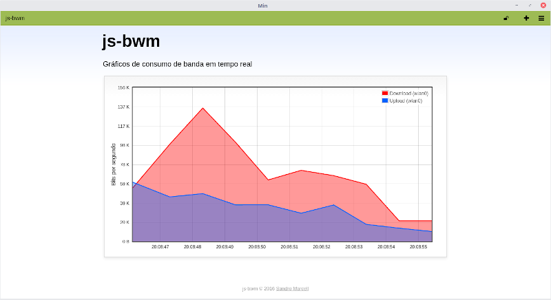

# Real-time bandwidth graphs
The "js-bwm" allows you to monitor the bandwidth consumption (download/upload) of your Internet link using graphics in real time, thus facilitating the visualization of how much traffic is being generated by your network.
## Development
### This project was developed and tested in the following environment:
```
- GNU/Linux 4.18.0-147.5.1.el8_1.x86_64 - CentOS Linux release 8.1.1911 (Core)
- PHP 7.2.11
- lighttpd/1.4.55
- jQuery 3.1.1
- Flot 0.8.3
```
## Setup
### 1 - Move this project to the web server's root directory
### 2 - Edit the file "stats.php" and look for the lines:
```
/* Monitored interface */
$iface = 'lo';
```
#### *Change the content of the "$iface" variable according to the interface you want to monitor*
### 3 - Set the owner and permissions according to the user who runs the web server daemon:
```
* Using the user "http" as an example:
chown -R http:http <WEB DIRECTORY>/js-bwm/
find <WEB DIRECTORY>/js-bwm/ -type d -exec chmod -R 755 {} +
find <WEB DIRECTORY>/js-bwm/ -type f -exec chmod -R 644 {} +
```
### 4 - Finally, access the "js-bwm": `http://<SERVER IP>/js-bwm/`



*P.S. Sorry for the bad translation... Yes, I used Google Translate.*  :bow:
